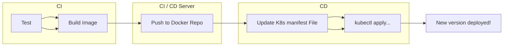
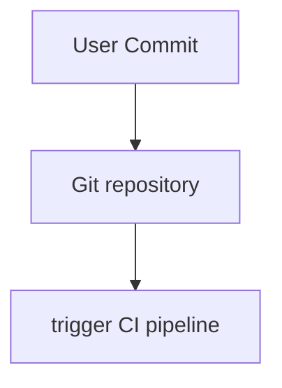
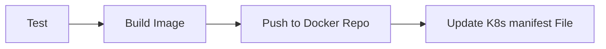
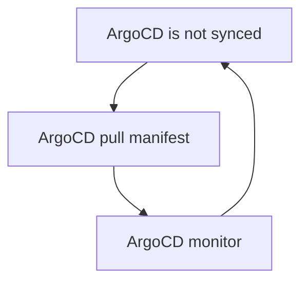
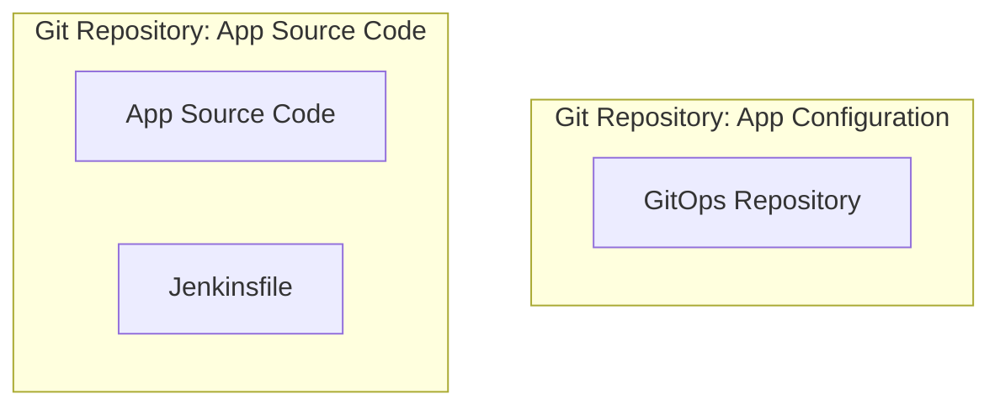
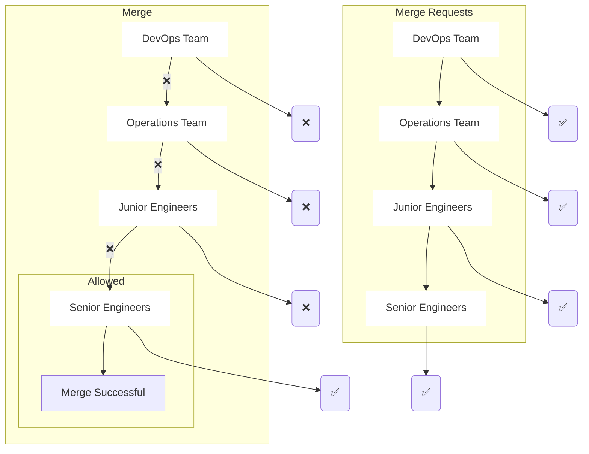

# Argo CD

## [Introduction](https://youtu.be/2WSJF7d8dUg)

### Install Argo

```shell
kubectl create namespace argocd
```

Option 1: Command

```shell
kubectl apply -n argocd -f https://raw.githubusercontent.com/argoproj/argo-cd/stable/manifests/install.yaml
```
```shell
kubectl -n argocd apply -f ./install.yaml
```

Option 2: Save as file

It's better becouse then manifest won't change if there is new update and also you would be able to see if there is any suspecios info in the yaml content.

```shell
curl -o install.yaml https://raw.githubusercontent.com/argoproj/argo-cd/stable/manifests/install.yaml
```

Check pods

```shell
kubectl -n argocd get pods
```

Output

Controller plane = Looks after all `kind: Application` values and will automatically sync with Argo API/CLI server.

API server = 

```shell
NAME                                               READY   STATUS             RESTARTS   AGE
argocd-application-controller-9f66f9c54-dtf2w      1/1     Running            0          19s  <-- controller plane
argocd-dex-server-559f749f75-nxlfl                 0/1     PodInitializing    0          19s
argocd-redis-868b8cb57f-nb49k                      1/1     Running            0          19s
argocd-repo-server-74f7d76f8b-w194q                0/1     ContainerCreating  0          18s
argocd-server-7c95d549d4-vgwrt                     0/1     Running            0          18s  <-- API server
```

[Port Forwarding](https://argo-cd.readthedocs.io/en/stable/getting_started/#port-forwarding)

```shell
kubectl port-forward svc/argocd-server -n argocd 8080:443
```

The API server can then be accessed using https://localhost:8080

```shell
kubectl apply -n argocd -f ./app.yaml
```
In argocd server GUI
- go to application tab, here you should see your newly created app.
- Check Logs for errors, image pull loop, bugs.

## [More Argo CD | Nana](https://youtu.be/MeU5_k9ssrs)

### CD workflow without Argo CD )=

CI/CD Server Example:

[test] -> [build image] -> [push to docker repo] -> [update K8s manifest file] -> [kubectl apply]



Challenges with this approach (configure on jenkins)
- Install and setup tools, like kubectl/helm
- configure access to K8s
- Configure access to cloud platforms
- Security challange (Cluster credentials external services and tools)
- Alot of projects will deploy applications to the cluster. Each project need its own kubernetes credential so it can only access the specific application resources in the cluster.
- Configure credentials for each and every cluster.
- No visibility in deployment status. Example: Jenkins does not know the status of execution, was app created, healthy status, failing to start?

### CD part can be improved - with Argo CD (=

Argo CD was built for:
- continous delivery for Kubernetes Cluster (more efficient)
- Based on GitOps
- No External access (e.g. Jenkins is external)
- Internal access (Argo CD is part of K8s cluster)

How it Argo CD works:
- ArgoCD agent pulls K8s manifest changes and applies them (compare to traditional: on push)

CD Workflow with ArgoCD
1. Deploy ArgoCD in K8s cluster.
2. Configure ArgoCD to track Git repository.
3. ArgoCD monitors for any changes and applies automatically.


User Commit and push source code repository



Jenkins CI-CD pipeline
- K8s manifest file will be updated in a separate git repo
  - e.g. Deployment.yaml will be updated in separate git repo



Argo CD is monitoring for changes and pulls them when out of sync



When updating manifest file usually the Deployment yaml file will change the version at `image: app:2.0` part.

#### Best Practice for Git Repository

-  Separate git repositories for application source code and application configuration (K8s manifest files).
- Even separate git repository for system configurations (First repo for source code and second repo for app configuration).

Why separate Git Repository?
- Not only Deployment.yaml, but also ConfigMap, Secret, Service, Ingress.

- K8s manifest files can change independent of source code.
- You don't want to trigger the full CI pipeline, when app source code has not changed while app config has.
- You don't want complex logic in CI pipeline that checks what have changed in K8s manifest.

Splitting **CI** (dev) and **CD** (ops)



**Git as Single Source of Truth**

Actual State (K8s) == Desired State (Git repository)
- Argo CD is keeping same K8s manifest state as based on whats specified in the desired state ('App Configuration Repository'/'GitOps Repository') Repository.
- So if a change happends in K8s State and its not same as in desired state, then Argo CD will sync with the desired state(pull from repo and update the K8s state)
- Full cluster transparency
- Guarantees that K8s manifests in Git remains single source of truth.
- Single interface.
- Version controlled changes (history of changes).
- better team collaboration.
- Easy rollback
- Cluster Disaster Recovery (Delete Old cluster and create a new one by pointing to same git repository)

Need a way to quickly update the cluster anyway?
- Configure ArgoCD to not sync manual cluster changes automatically.
  - Send alert instead

K8s manifests can be defined in different ways (works with ArgoCD)
- Kubernetes YAML files (Plane K8s YAML files).
- Helm Charts (Generated to Plane K8s YAML files).
- Kustomize - 'Kustomize.io' (Generated to Plane K8s YAML files).

#### Git Ops

ArgoCD is based on GitOps and helps implement those GitOps principles

#### K8S Access Control with Git & Argo CD



Not everyone should have access to K8s cluster
- Configure access rules easily with Git repositories.
  - 'Merge request', 'merge' privilege (different access premission).
  - No need to create ClusterRole & user resources in Kubernetes.
  - No cluster credential outside of K8s
    - Engineers do not need access for K8s cluster.
    - Instead give engineers access to git repository.
    - No need to give external cluster access to non human users e.g. Jenkins.

#### ArgoCD as K8s extension

Tutorial paused at 17:00/47:52