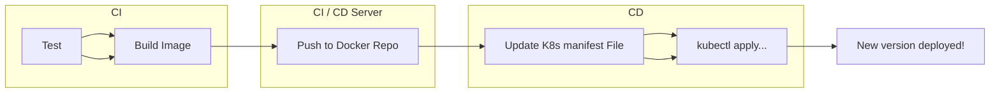
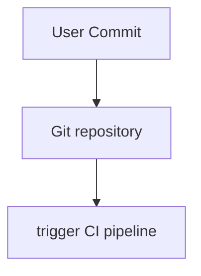
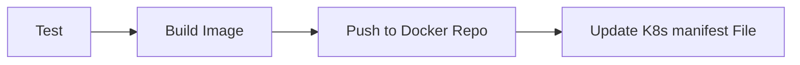
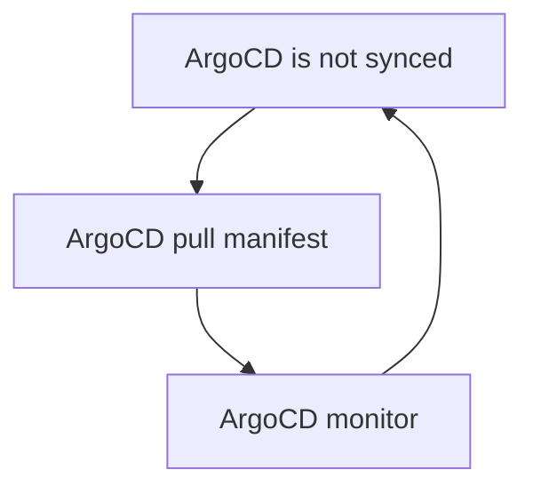
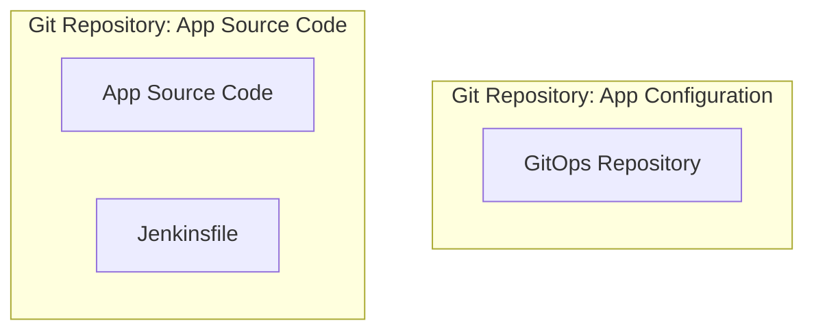
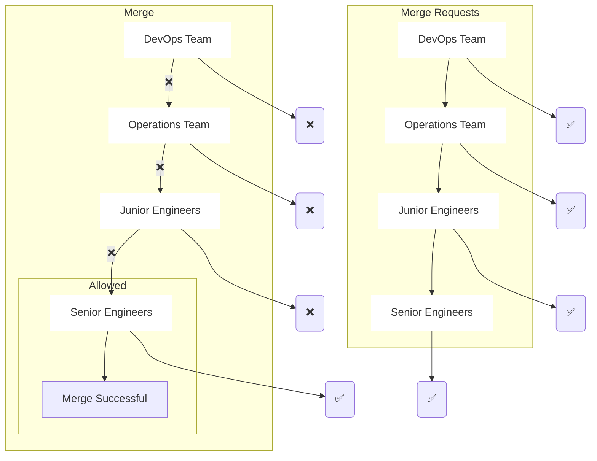
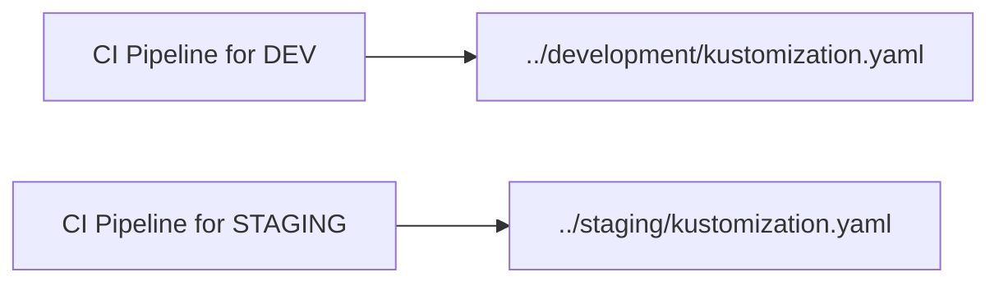

# Argo CD

## [Introduction](https://youtu.be/2WSJF7d8dUg)

### Install Argo

```shell
kubectl create namespace argocd
```

Option 1: Command

```shell
kubectl apply -n argocd -f https://raw.githubusercontent.com/argoproj/argo-cd/stable/manifests/install.yaml
```
```shell
kubectl -n argocd apply -f ./install.yaml
```

Option 2: Save as file

It's better becouse then manifest won't change if there is new update and also you would be able to see if there is any suspecios info in the yaml content.

```shell
curl -o install.yaml https://raw.githubusercontent.com/argoproj/argo-cd/stable/manifests/install.yaml
```

Check pods

```shell
kubectl -n argocd get pods
```

Output

Controller plane = Looks after all `kind: Application` values and will automatically sync with Argo API/CLI server.

API server = 

```shell
NAME                                               READY   STATUS             RESTARTS   AGE
argocd-application-controller-9f66f9c54-dtf2w      1/1     Running            0          19s  <-- controller plane
argocd-dex-server-559f749f75-nxlfl                 0/1     PodInitializing    0          19s
argocd-redis-868b8cb57f-nb49k                      1/1     Running            0          19s
argocd-repo-server-74f7d76f8b-w194q                0/1     ContainerCreating  0          18s
argocd-server-7c95d549d4-vgwrt                     0/1     Running            0          18s  <-- API server
```

[Port Forwarding](https://argo-cd.readthedocs.io/en/stable/getting_started/#port-forwarding)

```shell
kubectl port-forward svc/argocd-server -n argocd 8080:443
```

The API server can then be accessed using https://localhost:8080

```shell
kubectl apply -n argocd -f ./app.yaml
```
In argocd server GUI
- go to application tab, here you should see your newly created app.
- Check Logs for errors, image pull loop, bugs.

## [More Argo CD | Nana](https://youtu.be/MeU5_k9ssrs)

### CD workflow without Argo CD )=

CI/CD Server Example:

[test] -> [build image] -> [push to docker repo] -> [update K8s manifest file] -> [kubectl apply]



Challenges with this approach (configure on jenkins)
- Install and setup tools, like kubectl/helm
- configure access to K8s
- Configure access to cloud platforms
- Security challange (Cluster credentials external services and tools)
- Alot of projects will deploy applications to the cluster. Each project need its own kubernetes credential so it can only access the specific application resources in the cluster.
- Configure credentials for each and every cluster.
- No visibility in deployment status. Example: Jenkins does not know the status of execution, was app created, healthy status, failing to start?

### CD part can be improved - with Argo CD (=

Argo CD was built for:
- continous delivery for Kubernetes Cluster (more efficient)
- Based on GitOps
- No External access (e.g. Jenkins is external)
- Internal access (Argo CD is part of K8s cluster)

How it Argo CD works:
- ArgoCD agent pulls K8s manifest changes and applies them (compare to traditional: on push)

CD Workflow with ArgoCD
1. Deploy ArgoCD in K8s cluster.
2. Configure ArgoCD to track Git repository.
3. ArgoCD monitors for any changes and applies automatically.


User Commit and push source code repository



Jenkins CI-CD pipeline
- K8s manifest file will be updated in a separate git repo
  - e.g. Deployment.yaml will be updated in separate git repo



Argo CD is monitoring for changes and pulls them when out of sync



When updating manifest file usually the Deployment yaml file will change the version at `image: app:2.0` part.

#### Best Practice for Git Repository

-  Separate git repositories for application source code and application configuration (K8s manifest files).
- Even separate git repository for system configurations (First repo for source code and second repo for app configuration).

Why separate Git Repository?
- Not only Deployment.yaml, but also ConfigMap, Secret, Service, Ingress.

- K8s manifest files can change independent of source code.
- You don't want to trigger the full CI pipeline, when app source code has not changed while app config has.
- You don't want complex logic in CI pipeline that checks what have changed in K8s manifest.

Splitting **CI** (dev) and **CD** (ops)



**Git as Single Source of Truth**

Actual State (K8s) == Desired State (Git repository)
- Argo CD is keeping same K8s manifest state as based on whats specified in the desired state ('App Configuration Repository'/'GitOps Repository') Repository.
- So if a change happends in K8s State and its not same as in desired state, then Argo CD will sync with the desired state(pull from repo and update the K8s state)
- Full cluster transparency
- Guarantees that K8s manifests in Git remains single source of truth.
- Single interface.
- Version controlled changes (history of changes).
- better team collaboration.
- Easy rollback
- Cluster Disaster Recovery (Delete Old cluster and create a new one by pointing to same git repository)

Need a way to quickly update the cluster anyway?
- Configure ArgoCD to not sync manual cluster changes automatically.
  - Send alert instead

K8s manifests can be defined in different ways (works with ArgoCD)
- Kubernetes YAML files (Plane K8s YAML files).
- Helm Charts (Generated to Plane K8s YAML files).
- Kustomize - 'Kustomize.io' (Generated to Plane K8s YAML files).

#### Git Ops

ArgoCD is based on GitOps and helps implement those GitOps principles

#### K8S Access Control with Git & Argo CD



Not everyone should have access to K8s cluster
- Configure access rules easily with Git repositories.
  - 'Merge request', 'merge' privilege (different access premission).
  - No need to create ClusterRole & user resources in Kubernetes.
  - No cluster credential outside of K8s
    - Engineers do not need access for K8s cluster.
    - Instead give engineers access to git repository.
    - No need to give external cluster access to non human users e.g. Jenkins.

#### ArgoCD as K8s extension

What does it mean?
- ArgoCD uses K8s functionalities.
  - e.g. using etcd to store data.
  - e.g. using K8s controllers for monitoring and comparing actual and desired state
- BENEFIT: Visibility in the cluster.
  - Real-time updates of application state.
    - Pods created, Healthy status.
    - Pods failing, Rollback needed.

#### How to configure ArgoCD?

1. Deploy ArgoCD into K8s cluster.
   - Extends the K8s API with crd (Custom Resource Definition)
2. Configure ArgoCD with K8s YAML File.
   - Main Resource is "Application"
     - application.yaml
       - Which Git repository?
       - Which K8s cluster?
     - Possible to configure multiple application for different microservices.
       - e.g: billing-app.yaml, cart-app.yaml, shipping-app.yaml, frontend-app.yaml
         - Logically group applications
           - group them in another 'crd' called app project.
        - set restrictions
          - restrict: what (git repos) may be deployed.
          - restrict: where (cluster & namespaces) apps may be deployed to

e.g. Git repository with Cluster:
```
spec:
  project: default
  source:
    repoURL: https://gitlab.com/nanuchi/argocd-app-config.git
    targetRevision: HEAD
    path: dev
  destination:
    server: https://kubernetes.default.svc
    namespace: myapp
```

#### ArgoCD & Multi-Cluster Setups

Working with multiple clusters
- Configure and manage just 1 ArgoCD
- Same ArgoCD instance is able to sync a fleet of K8s clusters.

Working with multiple cluster environments
- development, staging, production (each environment have their own replicas).
  - In each environment we may deploy and run ArgoCD instances while still having 1 repository.
  - test app in each environment and promote to next one
    - e.g. git repository change -> ArgoCD sync with dev -> test dev -> test stage -> publish to prod

Working with multiple clusters

1. Git branch for each environment (Not as effected as second option)

2. Using overlays with kustomize (Better)
   
```
./myapp-cluster
├── base
│   ├── deployment.yaml
│   ├── kustomization.yaml
│   ├── rbac.yaml
│   └── service.yaml
└── overlays
├── development
│   └── kustomization.yaml
├── staging
│   └── kustomization.yaml
└── production
└── kustomization.yaml
```



Will ArgoCD replace CI/CD tools like Jenkins
- No, we still need CI pipeline to do tests, build image, push to docker registry, update K8s manifest file, etc.
- ArgoCD is an replacement for CD (Continous Delivery).

ArgoCD alternatives
- Flux CD
- JenkinsX

#### Demo

prerequisitive:
- empty minikube cluster

set up fully automated CD pipeline

1. Install ArgoCD in K8s cluster

Install Argo CD
```
kubectl create namespace argocd
kubectl apply -n argocd -f https://raw.githubusercontent.com/argoproj/argo-cd/stable/manifests/install.yaml
```

Check nodes/pods status
```shell
$ kubectl get pod -n argocd
```
```conf
NAME                                       READY   STATUS    RESTARTS   AGE
argocd-application-controller-0            1/1     Running   0          3m29s
argocd-dex-server-74454766c4-j6ccj         1/1     Running   0          3m29s
argocd-redis-5b6967fdfc-q85mq              1/1     Running   0          3m29s
argocd-repo-server-78d9fc859-6ghxr         1/1     Running   0          3m29s
argocd-server-779d76669-hkq2c              1/1     Running   0          3m29s
```

Check services
```shell
kubectl get svc -n argocd
```
```conf
NAME                   TYPE        CLUSTER-IP       EXTERNAL-IP   PORT(S)                      AGE
argocd-dex-server      ClusterIP   10.102.206.121   <none>        5556/TCP,5557/TCP,5558/TCP   3m54s
argocd-metrics         ClusterIP   10.99.85.79      <none>        8082/TCP                     3m54s
argocd-redis           ClusterIP   10.107.164.236   <none>        6379/TCP                     3m53s
argocd-repo-server     ClusterIP   10.108.145.142   <none>        8081/TCP,8084/TCP            3m53s
argocd-server          ClusterIP   10.104.30.139    <none>        80/TCP,443/TCP               3m53s
argocd-server-metrics  ClusterIP   10.103.55.117    <none>        8083/TCP                     3m53s
```

Forward the port for argocd-server service
```shell
kubectl port-forward -n argocd svc/argocd-server 8080:443
```
```shell
Forwarding from 127.0.0.1:8080 -> 8080
Forwarding from [::1]:8080 -> 8080
```

Get login password
```shell
kubectl get secret argocd-initial-admin-secret -n argocd -o yaml
```
```yaml
apiVersion: v1
data:
  password: Tk12UEN1VndwUDNRV2REcQ==
kind: Secret
metadata:
  creationTimestamp: "2021-10-11T08:03:33Z"
  name: argocd-initial-admin-secret
  namespace: argocd
  resourceVersion: "3095"
  uid: a872d061-2eec-4383-9aaf-a4b0dc1a901c
type: Opaque
```

Decode password
```shell
[W]$ echo Tk12UEN1VndwUDNRV2REcQ== | base64 --decode
```
```
NMvPCuVwpP3QWdDq%
```

Ignore the `%` (The percent sign (%) is often added by the shell to indicate that the previous output did not end with a newline character.)

webpage: `127.0.0.1:8080`

Password = `NMvPCuVwpP3QWdDq`
- Note: password is different for everyone becouse its autogenerated.

Username = `Admin`
- Note: username is always same if not changed.

2. Configure ArgoCD with "Application" CRD

Add [ArgoCD app configuration](https://argo-cd.readthedocs.io/en/stable/operator-manual/declarative-setup/#applications)

```yaml
apiVersion: argoproj.io/v1alpha1
kind: Application
metadata:
  name: guestbook
  namespace: argocd
spec:
  project: default
  source:
    repoURL: https://github.com/argoproj/argocd-example-apps.git
    targetRevision: HEAD
    path: guestbook
  destination:
    server: https://kubernetes.default.svc
    namespace: guestbook

  syncPolicy:
    syncOptions:
    - CreateNamespace=true

    automated:
      selfHeal: true
      prune: true
```

Note ArgoCD polls Git repository every 3 minutes
- if you dont want this delay, you can configure a Git webhook (Between git repo and ArgoCD)

```
kubectl apply -f application.yaml
```

visit [127.0.0.1:8080](https://127.0.0.1:8080)
- check if ArgoCD is synchronized with Git the repository and cluster.

3. Test our setup by updating Deployment.yaml file

Try to e.g. increment version of the application to the latest.

What do the buttons do in ArgoCD GUI?
- REFRESH: Compare the latest code in Git with the live state.
- SYNC: Move to target state, by actually applying the changes to the K8s cluster.
